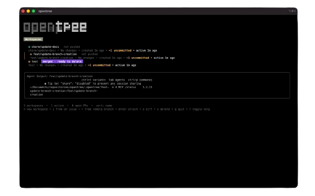

# opentree

**Orchestrate parallel AI coding sessions in isolated git worktrees.**

Think [Conductor](https://conductor.build), but for the terminal.

opentree is a cross-platform CLI tool that manages multiple AI coding agent sessions. Each session runs in an isolated git worktree with its own branch, orchestrated via tmux. Perfect for working on multiple features/fixes simultaneously without context-switching overhead.



## Features

- **🌳 Isolated Workspaces**: Each workspace = git worktree + branch + tmux window
- **🤖 Agent Integration**: Launch OpenCode (or other agents) automatically in each workspace
- **📊 TUI Dashboard**: Interactive terminal UI for managing workspaces (press `?` for help)
- **🔀 Parallel Development**: Work on multiple branches simultaneously without checkout overhead
- **📝 Diff Viewer**: Review changes before committing
- **🚀 PR Creation**: Create GitHub PRs directly from the TUI with auto-generated title and body
- **🐛 Issue Workflow**: Create a workspace directly from a GitHub issue number
- **✅ CI Status**: Live CI check status displayed per workspace
- **🔍 Filter & Sort**: Filter workspaces by name, sort by name/age/activity/PR status
- **🧹 Clean Lifecycle**: Archive workspaces after merge, keeping your repo tidy
- **⌨️ Shell Completion**: Tab completion for workspace names in bash, zsh, and fish

## Requirements

- **Git** (2.5+) - for worktree support
- **tmux** (2.0+) - for session orchestration
- **OpenCode** (optional) - default coding agent ([install](https://github.com/anomalyco/opencode))
- **GitHub CLI** (`gh`) (optional) - for PR creation and issue fetching ([install](https://cli.github.com/))

## Installation

### Homebrew (macOS/Linux)

```bash
brew install axelgar/tap/opentree
```

### From Source

```bash
git clone https://github.com/axelgar/opentree.git
cd opentree
go build -o opentree ./cmd/opentree
sudo mv opentree /usr/local/bin/
```

### Using Go Install

```bash
go install github.com/axelgar/opentree/cmd/opentree@latest
```

## Quick Start

```bash
# Navigate to any git repository
cd ~/my-project

# Launch TUI dashboard (interactive mode)
opentree

# Or use CLI commands directly
opentree new feat/add-auth       # Create workspace
opentree issue 42                # Create workspace from GitHub issue #42
opentree list                    # List all workspaces
opentree attach feat/add-auth    # Attach to tmux window
opentree diff feat/add-auth      # Review changes
opentree pr feat/add-auth        # Create GitHub PR
opentree delete feat/add-auth    # Clean up workspace
```

## Usage

### TUI Mode (Interactive)

Run `opentree` without arguments to launch the interactive dashboard:

```bash
opentree
```

**Navigation:**

- `↑`/`k` - move up
- `↓`/`j` - move down

**Actions:**

- `n` - Create new workspace (prompts for branch name, then base branch)
- `i` - Create workspace from a GitHub issue number
- `Enter` - Attach to selected workspace
- `d` - Show diff for selected workspace
- `p` - Create PR for selected workspace (auto-generates title and body from commits)
- `o` - Open PR in browser
- `x` - Delete selected workspace (shows diff confirmation if uncommitted changes)
- `space` - Toggle multi-select on current workspace
- `/` - Filter workspaces by name
- `s` - Cycle sort order (name → age → activity → PR)
- `E` - Toggle error log
- `?` - Toggle full help
- `q` - Quit

The TUI also shows a live **agent output preview** for the selected workspace and **CI check status** badges for open PRs.

### CLI Mode (Direct Commands)

#### Create a Workspace

```bash
opentree new <branch-name> [flags]

# Examples
opentree new feat/user-auth           # Create workspace with branch
opentree new fix/login-bug --base dev # Branch off 'dev' instead of 'main'
```

Creates:

1. Git worktree at `.opentree/<branch-name>/`
2. New branch (or checks out existing)
3. tmux window in `opentree-<repo>` session
4. Launches the configured coding agent in the workspace

#### Create Workspace from GitHub Issue

```bash
opentree issue <number> [flags]

# Examples
opentree issue 42              # Workspace from issue #42
opentree issue 42 --base dev   # Branch off 'dev'
```

Fetches the issue from GitHub, auto-generates a branch name (e.g. `issue-42-add-dark-mode`), and writes a `TASK.md` file with the issue title, labels, and description into the worktree so the AI agent can start working immediately. Requires the `gh` CLI.

#### List Workspaces

```bash
opentree list
```

Shows table with: branch name, status, last modified time.

#### Attach to Workspace

```bash
opentree attach <branch-name>
```

Attaches to the workspace's tmux window. Detach with `Ctrl+b d`.

#### Show Diff

```bash
opentree diff <branch-name>
```

Shows `git diff` between workspace and base branch.

#### Create Pull Request

```bash
opentree pr <branch-name> [flags]

# Examples
opentree pr feat/user-auth                                    # Interactive prompts
opentree pr feat/user-auth --title "Add user auth" --body "..." # Non-interactive
```

Requires GitHub CLI (`gh`) to be authenticated.

#### Delete Workspace

```bash
opentree delete <branch-name>

# Examples
opentree delete feat/user-auth
```

Removes the worktree, kills the tmux window, and deletes the branch. If uncommitted changes are detected, a diff is shown and confirmation is required before proceeding.

#### Install Shell Completion

```bash
opentree install-completion
```

Auto-detects your shell (zsh, bash, or fish) and installs tab completion. After installation, workspace names will be completed when using `attach`, `delete`, `pr`, and `diff` commands.

## Configuration

Create `opentree.toml` in your repo root or `~/.config/opentree/opentree.toml`. opentree searches up the directory tree for the config file, similar to how git finds `.git`.

```toml
[worktree]
base_dir = ".opentree"        # Where to store worktrees (relative to repo root)
default_base = "main"         # Default base branch

[agent]
command = "opencode"          # Command to launch agent
args = []                     # Additional arguments

[tmux]
session_prefix = "opentree"   # Prefix for the tmux session name

[github]
auto_push = false             # Auto-push branch before creating PR
```

### Using Different Agents

To use a different coding agent instead of OpenCode:

```toml
[agent]
command = "claude"            # Or "aider", "cursor", etc.
args = ["--some-flag"]
```

Or override per workspace:

```bash
OPENTREE_AGENT_COMMAND="claude" opentree new feat/my-feature
```

## How It Works

1. **Worktrees**: Git worktrees allow multiple checkouts of the same repo in different directories. Each workspace lives in `.opentree/<branch-name>/`.

2. **tmux Orchestration**: A single tmux session (`opentree-<repo>`) manages all workspaces. Each workspace = one tmux window. Attach to work, detach to switch.

3. **State Persistence**: Workspace metadata (branch, created time, agent, issue number) stored in `.opentree/state.json`.

4. **Agent Integration**: When creating a workspace, opentree launches your configured agent (default: OpenCode) inside the tmux window, ready to code.

5. **Issue Context**: When using `opentree issue`, a `TASK.md` file is written to the worktree containing the issue details, giving the AI agent immediate context.

## Workflow Example

```bash
# Start working on a feature
opentree new feat/add-dark-mode

# Or pick up a GitHub issue directly
opentree issue 42

# (tmux attaches automatically, agent launches)
# (work with AI agent, make changes...)
# (detach with Ctrl+b d when done)

# While that's building, start a bugfix in parallel
opentree new fix/header-overflow

# (work on bugfix...)
# (detach)

# Review changes for first feature
opentree diff feat/add-dark-mode

# Create PR when ready (auto-generates title and body from commits)
opentree pr feat/add-dark-mode

# Clean up after merge
opentree delete feat/add-dark-mode
```

## Troubleshooting

### "Error: not a git repository"

opentree must be run from inside a git repository. Navigate to your project root first.

### "Error: tmux not found"

Install tmux:

- **macOS**: `brew install tmux`
- **Ubuntu/Debian**: `sudo apt install tmux`
- **Arch**: `sudo pacman -S tmux`

### "Error: opencode not found"

Install OpenCode from [github.com/anomalyco/opencode](https://github.com/anomalyco/opencode), or configure a different agent in `opentree.toml`.

### "Error: gh not found"

Install GitHub CLI from [cli.github.com](https://cli.github.com/), then authenticate:

```bash
gh auth login
```

### Workspaces not appearing in TUI

State file might be corrupted. Check `.opentree/state.json` or delete and recreate workspaces.

## Contributing

Contributions welcome! Please open an issue or PR.

### Development Setup

```bash
git clone https://github.com/axelgar/opentree.git
cd opentree
go mod download
go build -o opentree ./cmd/opentree
./opentree --help
```

### Architecture

See [PLAN.md](PLAN.md) for detailed architecture documentation.

## License

MIT License - see [LICENSE](LICENSE) for details.

## Acknowledgments

- Inspired by [Conductor.build](https://conductor.build) by Sahil Lavingia
- Built with [Bubble Tea](https://github.com/charmbracelet/bubbletea) TUI framework
- Integrates with [OpenCode](https://github.com/anomalyco/opencode) AI coding agent
