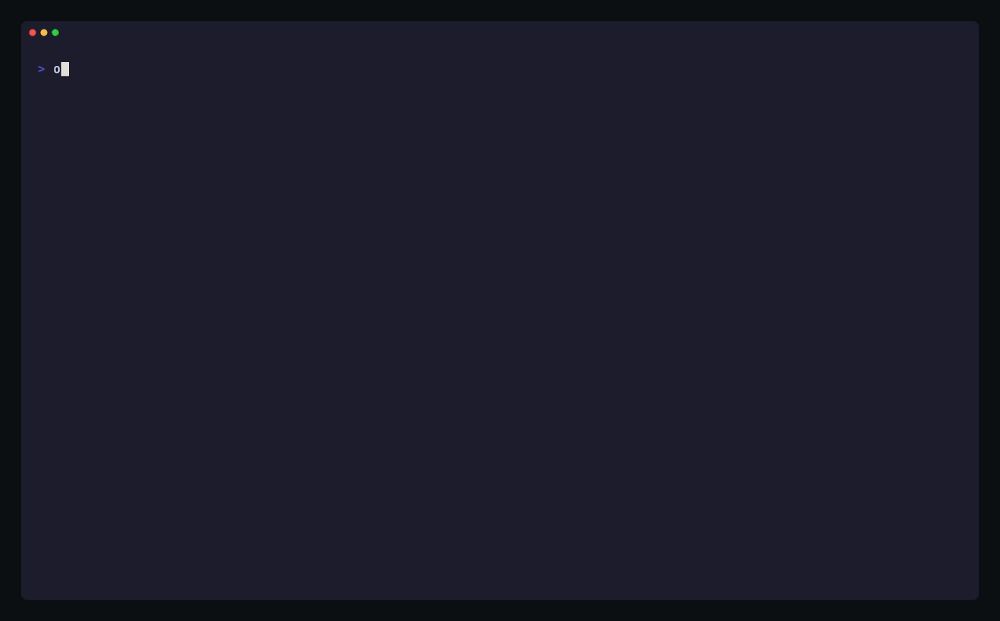

# opentree

**Orchestrate parallel AI coding sessions in isolated git worktrees.**

Think [Conductor](https://conductor.build), but for the terminal.

opentree is a cross-platform CLI tool that manages multiple AI coding agent sessions. Each session runs in an isolated git worktree with its own branch, orchestrated via tmux. Perfect for working on multiple features/fixes simultaneously without context-switching overhead.



## Features

- **🌳 Isolated Workspaces**: Each workspace = git worktree + branch + tmux window
- **🤖 Agent Integration**: Launch your agent automatically in each workspace
- **💬 Built-in Chat**: Every agent speaks the [Agent Client Protocol](https://agentclientprotocol.com) and runs inside opentree's own chat view — answer permissions, watch diffs, send images, and drive the agent from the dashboard without attaching
- **📊 TUI Dashboard**: Interactive terminal UI for managing workspaces (press `?` for help)
- **🔀 Parallel Development**: Work on multiple branches simultaneously without checkout overhead
- **📝 Diff Viewer**: Review changes before committing
- **🚀 PR Creation**: Create GitHub PRs directly from the TUI with auto-generated title and body
- **🐛 Issue Workflow**: Create a workspace directly from a GitHub issue number
- **✅ CI Status**: Live CI check status displayed per workspace
- **🔍 Filter & Sort**: Filter workspaces by name, sort by name/age/activity/PR status
- **🧹 Clean Lifecycle**: Archive workspaces after merge, keeping your repo tidy
- **⌨️ Shell Completion**: Tab completion for workspace names in bash, zsh, and fish

## Requirements

- **Git** (2.5+) - for worktree support
- **tmux** (3.0+) - for session orchestration
- **A coding agent** (optional) - OpenCode (the default), Claude Code, GitHub Copilot CLI or Gemini CLI
- **GitHub CLI** (`gh`) (optional) - for PR creation and issue fetching ([install](https://cli.github.com/))
- **Node** (optional) - only to run Claude Code through its ACP adapter

## Installation

### Homebrew (macOS/Linux)

```bash
brew install axelgar/tap/opentree
```

### npm

```bash
npm install -g @axelgar/opentree
```

### From Source

```bash
git clone https://github.com/axelgar/opentree.git
cd opentree
go build -o opentree ./cmd/opentree
sudo mv opentree /usr/local/bin/
```

### Using Go Install

```bash
go install github.com/axelgar/opentree/cmd/opentree@latest
```

## Quick Start

```bash
# Navigate to any git repository
cd ~/my-project

# Launch TUI dashboard (interactive mode)
opentree

# Or use CLI commands directly
opentree new feat/add-auth       # Create workspace
opentree issue 42                # Create workspace from GitHub issue #42
opentree list                    # List all workspaces
opentree attach feat/add-auth    # Attach to tmux window
opentree diff feat/add-auth      # Review changes
opentree pr feat/add-auth        # Create GitHub PR
opentree delete feat/add-auth    # Clean up workspace
opentree skills list             # See every agent skill on this machine
opentree skills sync             # Give every agent and workspace the repo's skills
```

## Usage

### TUI Mode (Interactive)

Run `opentree` without arguments to launch the interactive dashboard:

```bash
opentree
```

**Navigation:**

- `↑`/`k` - move up
- `↓`/`j` - move down

**Actions:**

- `n` - Create new workspace (prompts for branch name, then base branch)
- `i` - Create workspace from a GitHub issue number
- `Enter` - Attach to selected workspace
- `d` - Show diff for selected workspace
- `p` - Create PR for selected workspace (auto-generates title and body from commits)
- `o` - Open PR in browser
- `x` - Delete selected workspace (shows diff confirmation if uncommitted changes)
- `R` - Send the workspace's open PR review comments to its agent
- `space` - Toggle multi-select on current workspace
- `/` - Filter workspaces by name
- `s` - Cycle sort order (name → age → activity → PR)
- `E` - Toggle error log
- `tab` - Switch between Workspaces and Skills
- `?` - Toggle full help
- `q` - Quit

Each row also carries what its agent is doing — working, waiting on a
permission, stopped — plus cost and context use, read live from the chat's
control socket. Open PRs show **CI check status** badges.

### Skills

Skills are a filesystem convention rather than anything an agent exposes over
its API — a directory holding a `SKILL.md` — so opentree reads them directly.
Press `tab` for the inventory: every skill on the machine, which agents can
actually use each one, and what each agent will do with it.

- `enter` - Open the SKILL.md in `$EDITOR`
- `a` - Add a skill from a git URL
- `c` - Copy a skill into another agent's directory
- `x` - Delete a skill
- `t` - Switch a skill off for the agents that can be told
- `l` - Link the repository's skills to every agent and workspace that is missing them
- `v` - Ask the agent itself what it loaded, and flag anything the list got wrong

A `git worktree` carries only what git tracks, and most repositories leave
their skills untracked — so opentree links the repository's skills into each
workspace it creates. `opentree skills sync` repairs workspaces that predate
this, and `opentree skills list` prints the same inventory for a script.

### Talking to the agent

opentree talks to agents over the [Agent Client Protocol](https://agentclientprotocol.com)
(ACP) and draws the conversation itself, rather than handing the tmux window to
the agent's own TUI. You get the same worktree-per-branch
flow, but the agent's turns, tool calls, diffs, what each tool printed, and
permission prompts are rendered by opentree, which means the dashboard knows
what every agent is doing without scraping its output.

Press `Enter` on a workspace to attach to its chat:

```
 fix-auth  ◆ OpenCode                             claude-sonnet-4.6 · plan · 12% ctx · $0.0431

┃ add a rate limiter to the login handler

◆ Adding one keyed by client IP, and a test for the burst case.
   ✓ grep -rn rate.Limiter pkg/
     pkg/api/throttle.go:14: var limiter = rate.NewLimiter(rate.Every(time.Minute), 60)
   ✓ pkg/auth/login.go  +18 -2
     + limiter := rate.NewLimiter(rate.Every(time.Second), 5)
   ⠹ go test ./pkg/auth/

 ╭──────────────────────────────────────╮
 │ go test ./pkg/auth/                  │
 │ [a] Allow once                       │
 │ [A] Always allow                     │
 │ [d] Reject                           │
 ╰──────────────────────────────────────╯
 permission needed · esc to cancel
```

Each agent has its own mark and colour — `◆` for OpenCode, `✻` for Claude Code,
`◉` for GitHub Copilot, `✦` for Gemini CLI —
so the chat header and every workspace row in the dashboard say which agent you
are dealing with without being read word by word. An empty chat opens on the
agent's own logo, in its own colours:

```
 ▐▛███▜▌    Claude Code
▝▜█████▛▘   fix-auth
  ▘▘ ▝▝     ~/src/myrepo/.opentree/fix-auth
```

| Key | |
| --- | --- |
| `enter` | send |
| `ctrl+j` | newline |
| `/` | slash commands — the agent's own, plus `/resume`, `/model` and the rest |
| `@` | attach a file from this worktree |
| `ctrl+v` | paste — an image on the clipboard is attached, anything else is text |
| `esc` | interrupt the current turn |
| `shift+tab` | cycle the agent's mode (plan / build / …) |
| `ctrl+g` | settings — model, reasoning effort, anything else the agent declares |
| `ctrl+o` | show or hide the agent's reasoning |
| `?` | every key |

**Images.** Press `ctrl+v` to attach a screenshot from the clipboard, or drag one
onto the terminal. Either way the path collapses into `[image · shot.png · 412 KB]`
in the message you are writing — backspace over it and the attachment goes with
it — and it travels to the agent as a real image block. On macOS
that is `ctrl+v` and not `cmd+v`: `cmd+v` is the terminal's own paste, and a
terminal asked to paste a picture sends nothing at all. An agent that does not
take images gets the path as a link instead, and the chat says so rather than
letting the difference go unnoticed.

**Earlier conversations.** `/resume` lists what this worktree has already
talked about — newest first, by what each conversation was about — and picking
one reopens it in place, history and all. The list is the agent's own where it
keeps one, merged with what opentree recorded itself, so the command works the
same whichever agent is running.

The agent's live model, mode and effort sit on the right of the input, next to
the running context and cost. `ctrl+c` takes you back to the workspace list and
leaves the chat running: the agent keeps working, its row keeps reporting, and
attaching again drops you straight back into the conversation.

**From the dashboard.** You don't have to attach to drive a chat. With a
workspace selected, `m` sends it a prompt, `a` answers a pending permission
request, and `c` interrupts the current turn — the row shows what the agent is
doing, what it's waiting on, and what it has cost. A prompt sent to a busy agent
is queued rather than refused.

**Which agents.** OpenCode, GitHub Copilot CLI and Gemini CLI serve ACP
themselves, so having the binary is the whole setup. Claude Code is reached
through the `claude-agent-acp` adapter, which opentree installs on request into
`~/.opentree/tools` rather than your global npm root — press `A` in the
dashboard, pick Claude Code, and it offers the download (303MB, needs `node`).

Those four are the whole list. opentree drives agents over ACP and nothing else,
so an agent without an ACP server has no way in — if one ships support, it
becomes a single registry entry and everything above applies to it unchanged.

### CLI Mode (Direct Commands)

#### Create a Workspace

```bash
opentree new <branch-name> [flags]

# Examples
opentree new feat/user-auth           # Create workspace with branch
opentree new fix/login-bug --base dev # Branch off 'dev' instead of 'main'
```

Creates:

1. Git worktree at `.opentree/<branch-name>/`
2. New branch (or checks out existing)
3. tmux window in `opentree-<repo>` session
4. Launches the configured coding agent in the workspace

#### Create Workspace from GitHub Issue

```bash
opentree issue <number> [flags]

# Examples
opentree issue 42              # Workspace from issue #42
opentree issue 42 --base dev   # Branch off 'dev'
```

Fetches the issue from GitHub and auto-generates a branch name (e.g. `issue-42-add-dark-mode`). Requires the `gh` CLI.

#### List Workspaces

```bash
opentree list
```

Shows table with: branch name, status, last modified time.

#### Attach to Workspace

```bash
opentree attach <branch-name>
```

Attaches to the workspace's tmux window. Detach with `Ctrl+b d`.

#### Show Diff

```bash
opentree diff <branch-name>
```

Shows `git diff` between workspace and base branch.

#### Create Pull Request

```bash
opentree pr <branch-name> [flags]

# Examples
opentree pr feat/user-auth                                    # Interactive prompts
opentree pr feat/user-auth --title "Add user auth" --body "..." # Non-interactive
```

Requires GitHub CLI (`gh`) to be authenticated.

#### Send PR Reviews to the Agent

```bash
opentree review <branch-name>
```

Fetches the open PR's review comments and sends them to the workspace's agent as
a prompt, over the chat's control socket. The chat has to be running, but it
doesn't have to be the window you're looking at — and if the agent is mid-turn
the command says so rather than reporting a send that went nowhere.

#### Delete Workspace

```bash
opentree delete <branch-name>

# Examples
opentree delete feat/user-auth
```

Removes the worktree, kills the tmux window, and deletes the branch. If uncommitted changes are detected, a diff is shown and confirmation is required before proceeding.

#### Install Shell Completion

```bash
opentree install-completion
```

Auto-detects your shell (zsh, bash, or fish) and installs tab completion. After installation, workspace names will be completed when using `attach`, `delete`, `pr`, and `diff` commands.

## Configuration

Create `opentree.toml` in your repo root or `~/.config/opentree/opentree.toml`. opentree searches up the directory tree for the config file, similar to how git finds `.git`.

```toml
[worktree]
base_dir = ".opentree"        # Where to store worktrees (relative to repo root)
default_base = "main"         # Default base branch

[agent]
command = "opencode"          # Agent to run: "opencode", "claude", "copilot" or "gemini"

[tmux]
session_prefix = "opentree"   # Prefix for the tmux session name

[github]
auto_push = true              # Push branch before creating a PR (set false to push manually)
```

### Using Different Agents

To use one of the others instead of OpenCode:

```toml
[agent]
command = "claude"            # or "copilot", or "gemini"
```

Or press `A` in the dashboard to pick from the agents you have installed — it
writes the same config, and offers to fetch the ACP adapter if the agent needs
one. From the CLI:

```bash
opentree agents list           # what's installed, and which is active
opentree agents use claude     # switch this repo (--global for everywhere)
opentree agents setup claude   # fetch its ACP adapter, if it needs one
```

An agent opentree has no ACP spec for is refused up front, when you create a
workspace, rather than later inside a chat that cannot start.

## How It Works

1. **Worktrees**: Git worktrees allow multiple checkouts of the same repo in different directories. Each workspace lives in `.opentree/<branch-name>/`.

2. **tmux Orchestration**: A single tmux session (`opentree-<repo>`) manages all workspaces. Each workspace = one tmux window. Attach to work, detach to switch.

3. **State Persistence**: Workspace metadata (branch, created time, agent, issue number) stored in `.opentree/state.json`.

4. **Agent Integration**: When creating a workspace, opentree launches your configured agent inside the tmux window, ready to code. With no agent configured, it uses the first supported agent found on your PATH.

5. **The Chat**: The tmux window runs `opentree chat`, never the agent's own TUI. It holds one JSON-RPC connection to the agent over stdio and renders the conversation, so opentree sees every turn, tool call and permission request as structured data instead of scraped terminal output. The dashboard reaches a running chat over a Unix socket, which is how `m`, `a` and `c` work without attaching. Session IDs are kept in `state.json` so conversations survive closing the window.

## Workflow Example

```bash
# Start working on a feature
opentree new feat/add-dark-mode

# Or pick up a GitHub issue directly
opentree issue 42

# (tmux attaches automatically, agent launches)
# (work with AI agent, make changes...)
# (detach with Ctrl+b d when done)

# While that's building, start a bugfix in parallel
opentree new fix/header-overflow

# (work on bugfix...)
# (detach)

# Review changes for first feature
opentree diff feat/add-dark-mode

# Create PR when ready (auto-generates title and body from commits)
opentree pr feat/add-dark-mode

# Clean up after merge
opentree delete feat/add-dark-mode
```

## Troubleshooting

### "Error: not a git repository"

opentree must be run from inside a git repository. Navigate to your project root first.

### "Error: tmux not found"

Install tmux:

- **macOS**: `brew install tmux`
- **Ubuntu/Debian**: `sudo apt install tmux`
- **Arch**: `sudo pacman -S tmux`

### "opentree requires tmux >= 3.0"

opentree sets the agent's environment via `tmux new-window -e`, which needs tmux 3.0 or newer. Upgrade tmux with your package manager (e.g. `brew upgrade tmux`).

### "Error: opencode not found"

Install OpenCode from [github.com/anomalyco/opencode](https://github.com/anomalyco/opencode), or configure a different agent in `opentree.toml`.

### The chat says the agent needs an adapter

Claude Code speaks ACP through `claude-agent-acp`. Press `A` in the dashboard,
select Claude Code, and accept the download — it installs to `~/.opentree/tools`
and needs `node` on your PATH. If you already have the package installed
globally, opentree uses that instead of fetching a second copy.

### The chat says the agent needs credentials

The chat's stopped panel offers `[l]`, which runs the agent's own login command
(`opencode auth login`, `claude auth login`, `copilot login`) and restarts the
session when it finishes. Gemini CLI has no login command — it authenticates
from inside its own TUI — so its panel names the method the agent asked for and
leaves `[l]` off rather than offering a key that runs the wrong thing: run
`gemini` once, log in there, then `[r]` to restart. Anything else that stops an
agent offers `[r]` to restart it.

### "Error: gh not found"

Install GitHub CLI from [cli.github.com](https://cli.github.com/), then authenticate:

```bash
gh auth login
```

### Workspaces not appearing in TUI

State file might be corrupted. Check `.opentree/state.json` or delete and recreate workspaces.

## Contributing

Contributions welcome! Please open an issue or PR. See [CONTRIBUTING.md](CONTRIBUTING.md) for the quality checks to run first.

### Development Setup

```bash
git clone https://github.com/axelgar/opentree.git
cd opentree
go mod download
go build -o opentree ./cmd/opentree
./opentree --help
```

### Architecture

See [PLAN.md](PLAN.md) for detailed architecture documentation.

## License

MIT License - see [LICENSE](LICENSE) for details.

## Acknowledgments

- Inspired by [Conductor.build](https://conductor.build) by Sahil Lavingia
- Built with [Bubble Tea](https://github.com/charmbracelet/bubbletea) TUI framework
- Integrates with [OpenCode](https://github.com/anomalyco/opencode) AI coding agent
